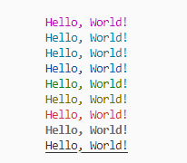
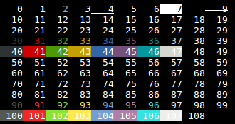

# Estilização

Informações relevantes de estilização para desenvolvimento de aplicações em Python.

> [!NOTE]
> Bibliotecas de automação: [Link](https://github.com/ESAran/Biblioteca-Python/blob/main/README.md#estiliza%C3%A7%C3%A3o "Bibliotecas")

## Trechos de códigos

### Coloração de print() no console

Pode também acumular e utilizar BOLD e Green por exemplo.

Documentação interessante: [gist.github](https://gist.github.com/rene-d/9e584a7dd2935d0f461904b9f2950007)

```python
class color:
   PURPLE = '\033[95m'
   CYAN = '\033[96m'
   DARKCYAN = '\033[36m'
   BLUE = '\033[94m'
   GREEN = '\033[92m'
   YELLOW = '\033[93m'
   RED = '\033[91m'
   BOLD = '\033[1m'
   UNDERLINE = '\033[4m'
   END = '\033[0m'

print(color.BOLD + 'Hello, World!' + color.END)

```


